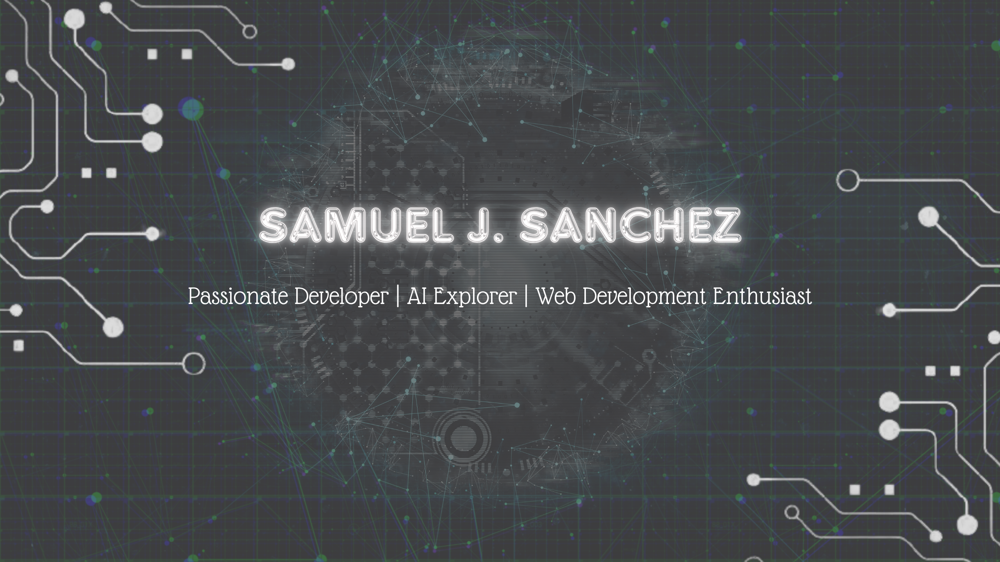

<h1 align="center">Hi there, I'm Samuel 👋</h1>

  

  👨‍💻 Passionate developer always eager to learn and grow. 
  🚀 Exploring the world of Artificial Intelligence. 
  🎮 Gamer | 📚 Explorer | 🌿 Nature lover

---

### 🚀 About Me

I'm a dedicated and proactive developer with a strong focus on continuous learning and improvement. I enjoy taking on new challenges and I'm currently deepening my knowledge in **Flutter**, **APIs**, and **Artificial Intelligence** using **Python** and tools like **Streamlit** and **Scikit-learn**.

---

### 🛠️ Tech Stack

- **Frontend:** HTML, CSS, Bootstrap, JavaScript, Flutter  
- **Backend:** PHP, Python, SQL  
- **Databases:** MySQL, PostgreSQL, Firebase  
- **Data Science / AI:** Python, Pandas, Scikit-learn, Prophet, Streamlit  
- **Tools:** Git, GitHub, VS Code

---

### 📌 Featured Projects

- 🍣 **Sushi Restaurant Website** – Static responsive website using HTML and CSS  
- ⚽ **Biwenger Demo (Flutter)** – UI prototype of the main game screen  
- ⛽ **Gas Station App** – Mobile app using a public REST API for real-time gas prices  
- ⚡ **REE Energy Analysis** – Web app with Streamlit + AI models to predict electricity generation in Spain  

> 👉 Check out more in my [GitHub repositories](https://github.com/Samu-Sr00?tab=repositories)

---

### 🌱 Currently Learning

- Advanced **AI applications** and ML model deployment  
- Building beautiful and scalable apps with **Flutter**  

---

### 🤝 Let's Connect

I'm open to new opportunities and collaborations that allow me to grow and contribute to exciting projects.

- 📧 Email: samueljsanchez24@gmail.com  
- 💼 LinkedIn: [Samuel J. Sanchez](https://www.linkedin.com/in/samuel-j-sanchez)
- 🖥️ Portafolio: [Portafolio Samuel J. Sanchez](https://www.samueljsanchez.es)

---

  Thanks for visiting my profile! 💙 Let's build something great together.

